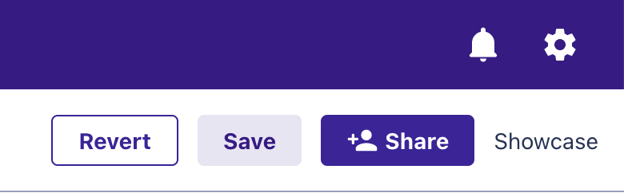
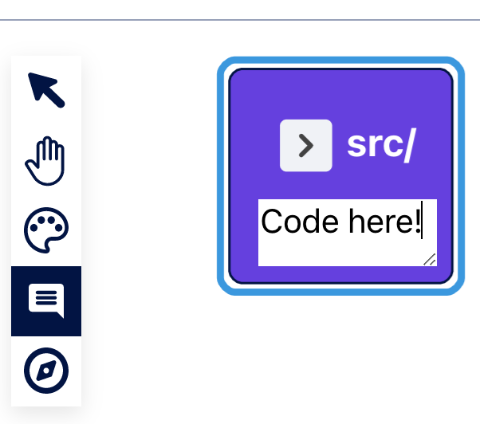
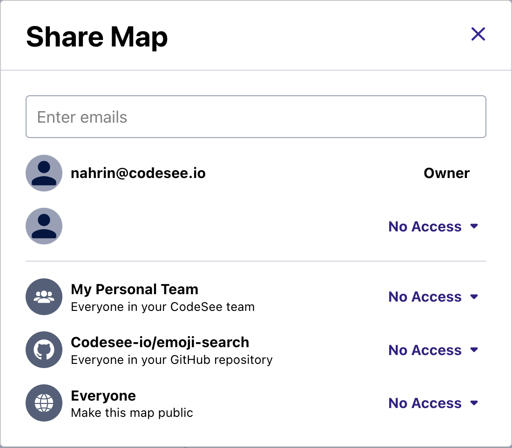

# User Guide

Your CodeSee Map is an interactive, editable diagram that shows all of the codebase dependencies across your repository.

## Exploring your Map

The Map begins with most folders collapsed. You can open and close a folder by clicking the toggle icon in the upper-left corner of the folder. You can change the positions of files and folders by clicking and dragging them to a new location on the canvas.

The arrows between files or folders indicate dependencies. Each dependency is represented by an arrow that points from one file to the file it uses.

### File Browser

The panel on the left side of the Map shows your codebase's entire file and folder tree. You can hide files or folders from the diagram by clicking the “eye” icon. You can also select multiple items by holding down Shift or Ctrl and clicking items.

Right-click to bring up a menu to hide all selected items, or hide everything in the repository except for what you selected.

Use this visibility feature to hide the parts of the repo that are not relevant to the Map you are making.

The file browser also includes a search bar at the top, where you can filter by the name of files or folders.

### Auto Insights

CodeSee will automatically gather insights from your repository. Use the toggle switches to enable or disable Insights on your Map. 

When Insights are displayed on your Map, your labels will be temporarily replaced by those corresponding to the insights themselves. To restore your labels, disable the Insight using the toggle switch.

Below the File Browser, you'll find three insight types:

- **Engineering Hot Spots**: See which files and folders have had the most recent commits.
- **Latest Activity**: See when the last commit to a file or folder was made.
- **Creation Date**: See when files and folders were created relative to today's date.
- **Lines of Code**: See how many lines of code files contain and quickly locate the largest files in your codebase.

### Data Panel

The Data Panel allows you to explore the code of the file or folder of your Map. Simply click on a node, and the Data Panel will automatically appear under your Map Legend. In addition, the Data Panel provides helpful information about the file or folder.

### Panning and zooming

Pan across your Map with your mouse’s scroll wheel or by clicking and dragging on the background of the Map. Zoom in and out by holding down the `Ctrl` key while scrolling.

You can activate Panning Mode by clicking on the Pan button, represented by a hand icon:

This will allow you to pan your Map by clicking and dragging. To return to node selection mode, click on the arrow icon.

You can also zoom in and out with the zoom controls at the bottom-right of the Map:

<!-- [visual of zooming] -->

## Editing your Map

If you are the owner of a Map, you also have tools to create annotations to help your team onboard to the codebase, understand team ownership, or learn key flows.

### Saving and reverting

As the owner, you will see a “Save” and “Revert” button above the Map on the right. Clicking “Save” will preserve the current state of the Map. This includes the positions of items and the expanded or collapsed state of any folders. “Revert” will return the Map to its last saved state.

### Creating a Tour
Tours are a way to create asyncronous, visual walkthroughs on a Map. Tours can be used for anything that comes to mind, showing where features are, tricky flows through files, helping to debug and more. 

[Here's a video of all of Tours!](https://user-images.githubusercontent.com/9168902/134231069-0f8542ec-87b2-4edb-98e6-6d4401d62ae2.mov)

To create a tour:

1. Click on the  in your left tool bar.
2. Click Add a Tour.
3. Provide a name for your tour.
4. Click Add a Step.
5. Click the node in the Map where you want to place the first step of your tour.
6. Add a description to the tour step.
7. Go back to step 4 and create as many tour steps as you'd like.

Additional tour options:

1. Click on the ellipses to:
- Add a second tour.
- Rename a tour.
- Delete a tour.

Viewing a Tour:

Tours will automatically display on the Map. 

Switch to view another tour:
1. Select the dropdown next to the name of your tour.
2. Select which tour you would like to view.

### Labels and colors

The legend is a panel in the upper-right corner of the Map. Here you can choose colors and labels that you can apply to files or folders in your Map.

To add a new label to the legend:

1. Click “Add a new label.”
1. Click on the placeholder text “New Label” to edit the text for the label at any time.
1. Click the colored tile on the left to select a color.

You can use labels to designate and color-code team ownership, indicate different codebase features, mark hotspots or tech debt, or whatever would be useful to you.

To assign colors to files or folders:

1. Click the “Color” tool, then choose the color you’d like to paint with.
1. Click on the files or folders you want to paint with that selected color.

### Right-Click Menu

By right-clicking on a file or folder, you'll get the following options:

#### Hide selected items

This will hide the items you've selected from the Map.

#### Show only selected items

This will hide all items that are not selected.

#### Show all

This will show all files and folders.

#### Add/edit note

This will allow annotating items.

### Notes

Use the Notes tool to add additional context to any file and folder.

To add notes to files or folders:

1. Click on the “Notes” tool.
1. Click on the file or folder you would like to annotate.
1. Type your note, then press “Return” to add it to the file or folder.

Notes on folders are available only when the folder is collapsed.

### Duplicate a Map

To create a copy of a Map, click on the overflow button (•••), then select “Duplicate map.”

> Note: Create filtered views to share by selecting specific parts of your diagram to show and hide via the [File Browser](#file-browser) or the [Right-Click Menu](#right-click-menu).

<!-- visual of filtered view -->

## Real-time Collaboration 

When Real-time Collaboration is enabled, multiple users can collaborate on a Map at the same time. Users will realize all edits to the Map are active—there is no Revert or Save. On a Team or Enterprise tier, you can share a document and provide editor status across a team.

Users will see an avatar circle with an initial. Two circles display where the Save icon used to exist, with one representing the other users who are active in the Map:

<!-- visual of the display -->
 
All changes are automatically persisted to the server, unless you are in Explorer mode, which allows you to interact with the Map without automatically saving changes. 

## Sharing your Map

If you’re the owner of the Map, you can share it with others. This can help your team with onboarding or alignment.

### Share settings

The share settings below affect only the visibility of the Map. Only you, as the owner, will be able to edit it.

To change the share settings of your Map:

1. Click “Share.”
1. Select one of these options:
    1. GitHub Organization
        1. Only members of your organization on GitHub with the link can view the diagram. GitHub repository members will see the diagram in “Your Maps.”
    1. Public
        1. Anyone with the link can view this diagram. GitHub repository members will see the diagram in “Your Maps.”
    1. Community
        1. Anyone with the link can view this diagram. GitHub repository members will see the diagram in “Your Maps.” Anyone can find it from the CodeSee Community page.

### Permissions
 
Users who are administrators on the Teams account—the individual who has upgraded the account—can then assign Team roles: Administrator, Collaborator/Editor, and Viewer. Roles are set and Team names can be set. 
 
Custom roles and permissions settings will be possible through the Enterprise license. With Groups permissions, for example, “Share this Map with all managers.” All Groups members have to have existing Maps accounts.
