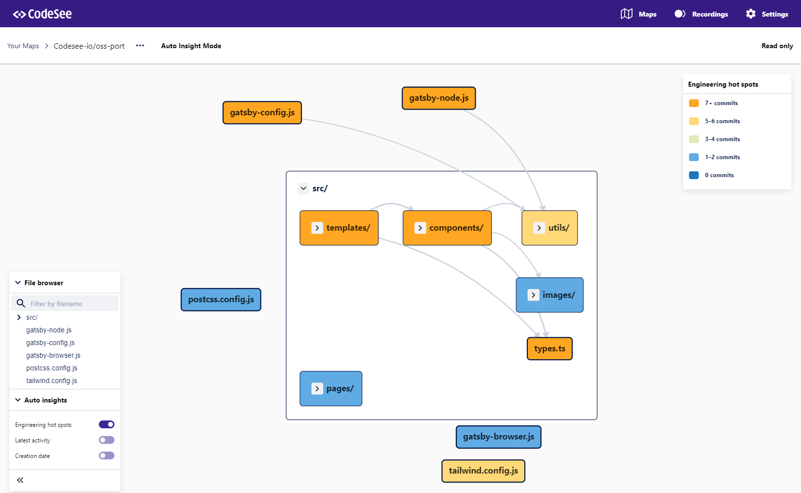
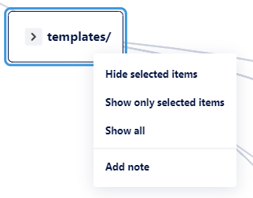

# User Guide

Your CodeSee map is an interactive, editable diagram that shows all of the codebase dependencies across your repository.

## Exploring your map

The map begins with most folders collapsed. You can open and close a folder by clicking the toggle icon in the upper-left corner of the folder. You can change the positions of files and folders by clicking and dragging them to a new location on the canvas.

The arrows between files or folders indicate dependencies. Each dependency is represented by an arrow that points from one file to the file it uses.

### Panning and zooming

Pan across your map with your mouse’s scroll wheel or by clicking and dragging on the background of the map. Zoom in and out by holding down the `Ctrl` key while scrolling.

<!-- [visual of zooming] -->

### File browser

The panel on the left side of the map shows your codebase's entire file and folder tree. You can hide files or folders from the diagram by clicking the “eye” icon. You can also select multiple items by holding down Shift or Ctrl and clicking items.

<!-- [visual of show and hide] -->

Right-click to bring up a menu to hide all selected items, or hide everything in the repository except for what you selected.

Use this visibility feature to hide the parts of the repo that are not relevant to the map you are making.

The file browser also includes a search bar at the top, where you can filter by the name of files or folders.

### Auto insights

CodeSee will automatically gather insights from your repository. Use the toggle switches to enable or disable the insights on your Map. 

Your labels will be temporarily replaced by those corresponding to the insights themselves, but don't worry! All you have to do is disable the insight to restore yours!

Below the File Browser, you'll find three insight types:

- **Engineering Hot Spots**: See which files and folders have had the most recent commits.
- **Latest Activity**: See when the last commit to a file or folder was made.
- **Creation Date**: See when files and folders were created relative to today's date.

## Editing your map

If you are the owner of a map, you also have tools to create annotations to help your team onboard to the codebase, understand team ownership, or learn key flows.

### Saving and reverting

As the owner, you will see a “Save” and “Revert” button above the map on the right. Clicking “Save” will preserve the current state of the map. This includes the positions of items and the expanded or collapsed state of any folders. “Revert” will return the map to its last saved state.

### Labels and colors

The legend is a panel in the upper-right corner of the map. Here you can choose colors and labels that you can apply to files or folders in your map.

To add a new label to the legend:

1. Click “Add a new label.”
1. Click on the placeholder text “New Label” to edit the text for the label at any time.
1. Click the colored tile on the left to select a color.

You can use labels to designate and color-code team ownership, indicate different codebase features, mark hotspots or tech debt, or whatever would be useful to you.

To assign colors to files or folders:
1. Click the “Color” tool, then choose the color you’d like to paint with.
1. Click on the files or folders you want to paint with that selected color.

<!-- [visuals of legend + coloring nodes] -->

### Right-Click Menu

By right-clicking on a file or folder, you'll get the following options:

#### Hide selected items

This will hide the items you've selected from the map.

#### Show only selected items

This will hide all items that are not selected.

#### Show all

This will show all files and folders.

#### Add/edit note

This will allow annotating items.

### Notes

Use the Notes tool to add additional context to any file and folder.

To add notes to files or folders:

1. Click on the “Notes” tool.
1. Click on the file or folder you would like to annotate.
1. Type your note, then press “Return” to add it to the file or folder.

Notes on folders are available only when the folder is collapsed.

<!-- [visual of Notes tool] -->

### Duplicate a map

To create a copy of a map, click on the overflow button (•••), then select “Duplicate map.”

> Note: Create filtered views to share by selecting specific parts of your diagram to show and hide via the [File Browser](#file-browser) or the [Right-Click Menu](#right-click-menu).

<!-- [visual of filtered view] -->

## Sharing your map

If you’re the owner of the map, you can share it with others. This can help your team with onboarding or alignment.

### Share settings

The share settings below affect only the visibility of the map. Only you, as the owner, will be able to edit it.

To change the share settings of your map:

1. Click “Share.”
1. Select one of these options:
    1. GitHub Organization
        1. Only members of your organization on GitHub with the link can view the diagram. GitHub repository members will see the diagram in “Your Maps.”
    1. Public
        1. Anyone with the link can view this diagram. GitHub repository members will see the diagram in “Your Maps.”
    1. Community
        1. Anyone with the link can view this diagram. GitHub repository members will see the diagram in “Your Maps.” Anyone can find it from the CodeSee Community page.
