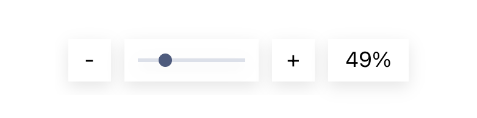

# User Guide

Your CodeSee Map is an interactive, editable architecture diagram that shows all of the codebase dependencies across your repository.

## Exploring your Map

Maps begin with most folders collapsed. You can open and close a folder by clicking the toggle icon in the upper-left corner of the folder. You can change the positions of files and folders by clicking and dragging them to a new location on the canvas.

The arrows between files or folders indicate dependencies. Each dependency is represented by an arrow that points from one file to the file it uses.

### File Browser

The panel on the left side of the Map shows your codebase's entire file and folder tree. You can hide files or folders from the diagram by clicking the “eye” icon. You can also select multiple items by holding down Shift or Ctrl and clicking items.

Right-click to bring up a menu to hide all selected items, or hide everything in the repository except for what you selected.

Use this visibility feature to hide the parts of the repo that are not relevant to the Map you are making.

The file browser also includes a search bar at the top, where you can filter by the name of files or folders.

### Auto Insights

CodeSee will automatically gather insights from your repository. Use the toggle switches to enable or disable Insights on your Map.

When Insights are displayed on your Map, your labels will be temporarily replaced by those corresponding to the insights themselves. To restore your labels, disable the Insight using the toggle switch.

Below the File Browser, you'll find three insight types:

* **Engineering Hot Spots**: See which files and folders have had the most recent commits.
* **Latest Activity**: See when the last commit to a file or folder was made.
* **Creation Date**: See when files and folders were created relative to today's date.
* **Lines of Code**: See how many lines of code files contain and quickly locate the largest files in your codebase.

### Data Panel

The Data Panel allows you to explore the code of the file or folder of your Map. Simply click on a node, and the Data Panel will automatically appear under your Map Legend. In addition, the Data Panel provides helpful information about the file or folder.

### Panning and Zooming

Pan across your Map with your mouse’s scroll wheel or by clicking and dragging on the background of the Map. Zoom in and out by holding down the Ctrl key while scrolling.

You can activate Panning Mode by clicking on the Pan button, represented by a hand icon. This will allow you to pan your Map by clicking and dragging. To return to node selection mode, click on the arrow icon.

You can also zoom in and out with the Zoom controls at the bottom-right of the Map interface:

## Editing your Map

As collaborators on a Map, you have access to tools to help your team onboard to the codebase, understand team ownership, learn key flows, and more. 

### Real-time Collaboration

Real-time Collaboration allows multiple users to make changes to a Map at the same time. Users actively collaborating in the Map are represented with avatars containing their initial and a cursor that follows their activity on the Map. 

<!-- visual of the display -->

#### Modes

Maps have three Modes: **Edit**, **View**, and **Playground**.

Playground Mode allows users to freely experiment with ideas on a Map—no changes will be saved to the original Map. 

> Collaborators have access to all Modes, whereas Viewers have access to only View and Playground.

### Tours

Tours are a way to create asynchronous, visual walkthroughs on a Map. Tours can be used for anything that comes to mind, showing where features are, tricky flows through files, helping to debug, and more.

[Here's a video of all of Tours!](https://user-images.githubusercontent.com/9168902/134231069-0f8542ec-87b2-4edb-98e6-6d4401d62ae2.mov)

#### Create Tours

1. Click on the Tours icon on your left toolbar.
1. Click "Add a Tour."
1. Provide a name for the Tour.
1. Click "Add a Step."
1. Click the node in the Map where you want to place the first step of your Tour.
1. Add a description to the Tour step.
1. Go back to Step 4 and create as many Tour steps as you'd like!

#### View Tours

Tours will automatically display at the top of your Map interface.

To navigate between multiple Tours: 
1. Select the dropdown next to the name of your Tour. 
1. Select the Tour you would like to view.

#### Additional Tour Options

Click on the overflow button (•••) in the toolbar to:
* Add a second Tour.
* Rename a Tour.
* Delete a Tour.

### Labels and Colors

The legend is a panel in the upper-right corner of the Map. Here you can choose colors and labels that you can apply to files or folders in your Map.

To add a new Label to the legend:
1. Click “Add a new label.”
1. Click on the placeholder text “New Label” to edit the text for the label at any time.
1. Click the colored tile on the left to select a color for files and folders with that Label.
1. You can use labels to designate and color-code team ownership, indicate different codebase features, mark hotspots or tech debt, or whatever would be useful to you.

To assign colors to files or folders:
1. Click the Color tool, then select the color you’d like to use.
1. Click on the files or folders you want to paint with that selected color.

### Right-Click Menu

By right-clicking on a file or folder, you'll get the following options:

#### Hide selected items
This will hide the items you've selected from the Map.

#### Show only selected items
This will hide all items that are not selected.

#### Show all
This will show all files and folders.

#### Add/edit note
This will allow annotating items.

### Notes

Use the Notes tool to add additional context to any file and folder.

1. Click on the “Notes” tool.
1. Click on the file or folder you would like to annotate.
1. Type your note, then press "Enter" on your keyboard to add it to the file or folder.

> Notes on folders are available only when the folder is collapsed.

### Duplicate a Map

To create a copy of a Map, click on the overflow button (•••), then select “Duplicate.”

> Note: Create filtered views to share by selecting specific parts of your diagram to show and hide via the [File Browser](#file-browser) or the [Right-Click Menu](#right-click-menu).

<!-- visual of filtered view -->

## Sharing your Map

As a Map Owner or Collaborator, you can share it with others.

To change the share settings of your Map, click the “Share” button located on the top-right corner of the interface: 

### Sharing With Individuals

To share the Map with specific **individuals**:
1. Enter the email addresses of individuals you would like to invite. Press the tab or enter key after each email address. 
1. Once all email addresses have been entered, hit return once more to submit. 

#### Individual Share Permissions 

| Account Role         | Map Permissions         | 
|--------------|----------------|
| Owner        | Read, Write, ability to assign and update the roles of members | 
| Collaborator       |  Read, Write | 
| Viewer       | Read           |

### Sharing With Groups

To share the Map with a **group**, select from the following options:
1. **Your Team**
Only members of your CodeSee Team will be able to view the Map. Team members will see the Map on their CodeSee dashboard.
1. **The GitHub Repository**
Only those with Read (or more) access to the GitHub repository can view the Map. GitHub repository members will see the Map on their CodeSee dashboard.
1. **Everyone**
Anyone with the link can view the Map. 

#### Group Share Permissions 

| Group Type        | Map Permissions                                           | 
|-------------------|-----------------------------------------------------------|
| Your Team              | Role-based*, or Read, or no access | 
| GitHub Repository | Read or no access                                        | 
| Everyone          | Read                                                      |

*Owners and Collaborators have Read or Write permission on the Maps. Viewers only have Read permission on the Map.
