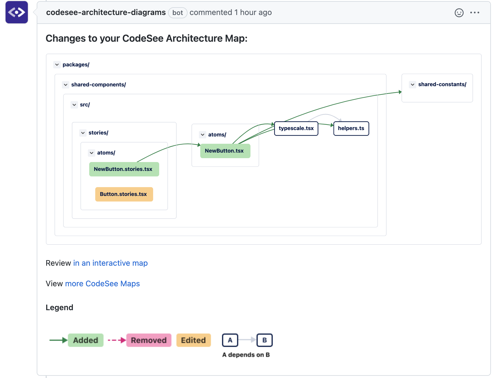
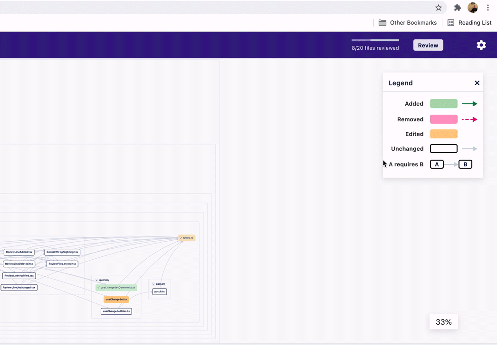

# Review Maps

Once [a map is installed on a repository](./installation.md), Review Maps will be automatically generated for every pull request made to the repository. There is also an “Install Review Maps” button on the `/maps` page to get you up and running. 

## Generating A Review Map

To get started, make a pull request to the repository.

Once that's done, the `codesee-architecture-diagrams` bot will automatically comment on your pull request with an image of a Review Map showing the files impacted by the PR, along with a Map Legend. Code is grouped intuitively so that you can review based on logic and functionality. For example, choose to review left to right (general to more specific) or review sections based on type (back-end vs. front-end changes, etc.)

The Map Legend consists of three types of changes:

* **Added**: Files/folders added in this pull request
* **Removed**: Files/folders removed in this pull request
* **Edited**: Files/folders that have been modified in this pull request

If commits are made to a pull request, a new Review Map will be generated.

## Interacting With A Review Map

Directly below your Review Map is a link to "Review in an interactive map," allowing you to explore the individual nodes of your Map. Click on a file to highlight its connections. Expand and collapse folders or zoom into and out of the Review Map by using the Zoom UI. 

To access PR-related details during the review, look to the header at the top of the page. Then,

  * Click the PR title or number to navigate to that PR in GitHub.
  * Click the PR author to visit that user’s page in GitHub.
  * Click on the (i) icon to see the full PR description.

### Code Diffs

Double-click on individual nodes in a Map to view code in a diff format. Each file gets a color swatch that indicates whether the file was added, removed, edited, renamed, or is unchanged. 

Double-clicking on an “unchanged” file (the white nodes on the Map) will also display their code.

When viewing a file, any related files (files it imports, and files that import it) that remain unchanged will also be listed in the diff. Unchanged files start with all their code hidden, but can be displayed by clicking on a file header to expand/collapse that file. 

To return to the full Review Map, click on the back arrow in the header. 

### Progress Bar

Mark sections as 'Reviewed' via the checkboxes as you move through the code review. When the checkbox is selected, nodes on the Map are displayed as “Reviewed,” and files within the diff collapse. A progress bar indicating the number of files in the PR that have been reviewed is visible in the header. 

### Comments

Provide feedback on reviews by placing and responding to comments within the code diffs. Comments are instantly reflected in both the repository and in CodeSee.

## Submit A Code Review

Click the “Review” button in the header to make a final review comment approving, requesting changes, or commenting on the pull request. 

_A Note On Permissions_: 

On a **public** repository, logged-out users or users without a CodeSee account can view a Review Map. However, users looking to comment or submit a review will be prompted to log in.

On a **private** repository, logged-out users or users without a CodeSee account cannot view a Review Map. The user will be prompted to log in or sign up to view the Review Map.

## Review Maps for Visual Studio Code

CodeSee’s extension for Visual Studio Code allows you to contextualize the potential impact of code changes, address feedback, and submit reviews—all within your editor. 

### Install CodeSee for VS Code

> As a prerequisite, ensure you have a [CodeSee account](https://app.codesee.io/) and CodeSee Maps is installed in your repository.

1. You can find the CodeSee VS Code extension in the [Visual Studio Marketplace](https://marketplace.visualstudio.com/items?itemName=codesee.maps). Click **Install** to add the extension to your editor. Alternatively, search for "CodeSee" within VS Code.
2. Install the [GitHub Pull Requests and Issues extension](https://marketplace.visualstudio.com/items?itemName=GitHub.vscode-pull-request-github).
3. Open your desired GitHub repository in VS Code.
4. Log in to your CodeSee account when prompted by the sidebar.

### Usage

#### Local

When browsing a pull request locally, open the command palette with `Ctrl/Cmd` + `Shift` + `P` and choose `CodeSee: Open Review Map`. This will open a visual representation of the pull request.

- Use your mouse to drag the map around.
- Use `Ctrl` + your mouse wheel to zoom in and out.
- Click on a file to view its dependencies and tune out the rest.
- Double-click on a file to open a diff view.
- Right-click on a file to mark it as viewed—this will be reflected in GitHub.

#### GitHub Pull Request Sidebar

When viewing a file inside the sidebar of the GitHub Pull Request & Issues extensions, you can create a Review Map of those changes without checking out the branch:

- Open the [GitHub Pull Requests and Issues](https://marketplace.visualstudio.com/items?itemName=GitHub.vscode-pull-request-github) sidebar.
- Choose a pull request under any category. The "All Open" category is a good place to start.
- Expand the pull request you want to view and open a file within.
- Open a Review Map using the command palette.

### Feedback 
Feel free to provide feedback or submit feature requests to [support@codesee.io](mailto:support@codesee.io).
