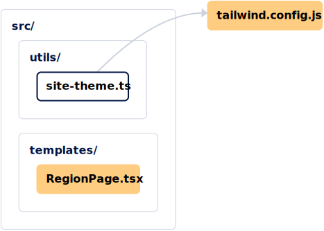
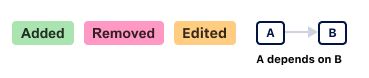

# Review Maps

Once [a map is installed on a repository](./installation.md), Review Maps will be automatically generated for every pull request made to the repository. There is also an “Install Review Maps” button on the `/maps` page which will get you up-and-running. 

## Generating A Review Map

To get started, make a pull request to the repository.

Once that's done, the `codesee-architecture-diagrams` bot will automatically comment on your pull request with an image of a Map showing the files impacted by the PR, along with a Map legend. Code is grouped intuitively so that you can review based on logic and functionality. For example, choose to review left to right (general to more specific) or vice versa and review sections based on type (back-end vs. front-end changes, etc.)

Below is an example from [Distribute Aid](https://distributeaid.org/)'s public repository:

The legend consists of three types of changes:

* **Added**: Files/folders added in this pull request
* **Removed**: Files/folders removed in this pull request
* **Edited**: Files/folders that have been modified in this pull request

If commits are made to this pull request, a new Review Map will be generated.

## Interacting With Your Review Map

Directly below your Review Map, is a link to "Review in an interactive map," allowing you to explore the individual nodes of your Map. Expand and collapse folders or zoom into and out of the Review Map by using the Zoom UI. To reference the full pull request description at any point of your review, click the (i) icon in the header.

### Code Diffs

Double-click on individual nodes in a Map to view code in a code diff. Each file gets a color swatch that quickly shows if the file was added, removed, edited, renamed, or is unchanged. Double-clicking on an “unchanged” file (the white nodes on the map) will also display their code.

When viewing a file diff, if there are related files that are unchanged, they will also be listed in the diff. Unchanged files start with all their code hidden, but can be displayed with one click.

At any point of viewing the code diff, you can click on a file header to expand/collapse that file. This works in concert with the existing “Reviewed” checkbox.

### Progress Bar

Mark sections as 'Reviewed' via the checkboxes as you move through a code review. When the checkbox is selected, nodes on the map are displayed as “Reviewed” and files within the diff collapse. A progress bar indicating the number of files in the PR that you have reviewed is visible in the header. 

### Review Comments

Provide feedback on reviews by placing and responding to comments within the code diffs. Comments are automatically reflected in the repository.
